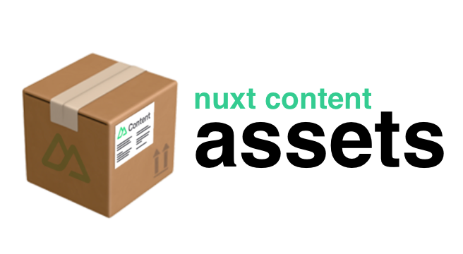

# Demo

Relative paths:

- [Image in same folder](/recipes/italian-bean-stew)
- [Image in sub folder](/recipes/pesto-salmon-lentils)
- [Image in parent folder](/recipes/sicilian-fish-stew)

Linking and embedding other file types:

- [Media and files](/media)

Frontmatter transformation:

- [Image src as frontmatter variable](/recipes/turkey-casserole)
- [Gallery example](/recipes) 

External sources

- [Content from GitHub](/external) (need to enable in `nuxt.config.ts`)

GitHub:

- [Repo and docs](https://github.com/davestewart/nuxt-content-assets)
