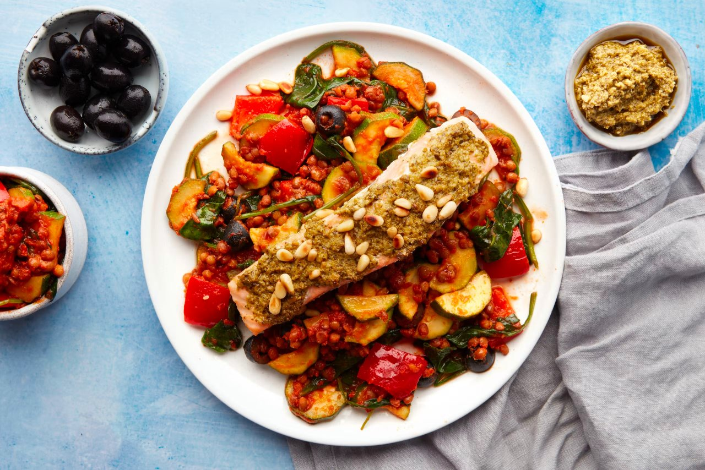

# Pesto Salmon & Mediterranean-style Lentils

> Image in sub folder

Slathered in peppery basil pesto, sprinkled with pine nuts and baked until irresistibly golden. Sustainably sourced salmon is a decadent partner for tomato-stewed lentils. Add plump black olives and sliced courgettes to complete the Mediterranean vibes.

## Info

- Cook time: 20 mins
- Cuisine: Mediterranean
- Food group: Fish
- Key ingredient: Fresh, sustainably caught salmon fillet
- Allergens: Celery, Fish

## Ingredients

- 2 salmon fillets (skin on) (Fish)
- 1 red pepper
- 1 courgette
- 200g passata
- 240g lentils in water (drained)
- 15g pitted black olives
- 10g pine nuts
- 40g baby spinach
- 1 tbsp green pesto
- 1 vegetable stock cube (use half) (Celery)
- 1 tbsp italian paste

## Instructions

Preheat the oven to 200C / fan 180C / gas mark 6. 

Thinly slice the courgette into half-moons. Cut the pepper into 3-4cm squares. 

Heat a medium frying pan with 1 tsp oil on medium heat. Add the prepped veg and cook for 3 mins, until softening. Season with sea salt and black pepper.

Place the salmon on a lined baking tray. Spread over the pesto and sprinkle with pine nuts. Season with sea salt. Bake for 8-10 mins, until cooked through.

Halve the olives and add to the frying pan along with the passata, Italian paste, spinach and 50ml hot water (25ml for 1 person). Crumble in half the stock cube and stir to dissolve. Simmer for 8-10 mins, until the sauce thickens. 

Drain and rinse the lentils, then stir them through the sauce. Season with a pinch of sea salt and black pepper.

Serve the vegetable lentils topped with the pesto-coated salmon.

---

Recipe from [Mindful Chef](https://www.mindfulchef.com/healthy-recipes/roasted-pesto-salmon-and-mediterranean-style-lentils)
