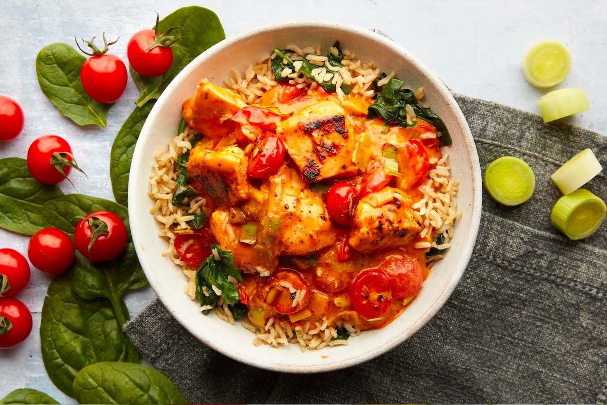

# Recipes

Here are four delicious recipes:

::div{class="columns is-multiline"}
  ::div{class="column is-half"}
    
  ::
  ::div{class="column is-half"}
    
  ::
  ::div{class="column is-half"}
    
  ::
  ::div{class="column is-half"}
    
  ::
::
