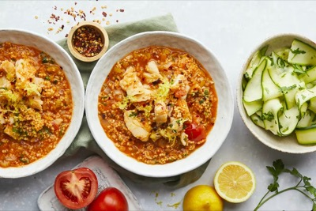

# Srcset

The module automatically generates `srcset` and `sizes` attributes when it finds high resolution variants of an image.

For an image `stew.jpg`, if a sibling `stew@2x.jpg` exists, the rendered image gains a `srcset` with both files:

Inspect the image to see the generated attributes. Variants are matched using the `srcset.pattern` option, which defaults to `{name}@{scale}x.{ext}`.
