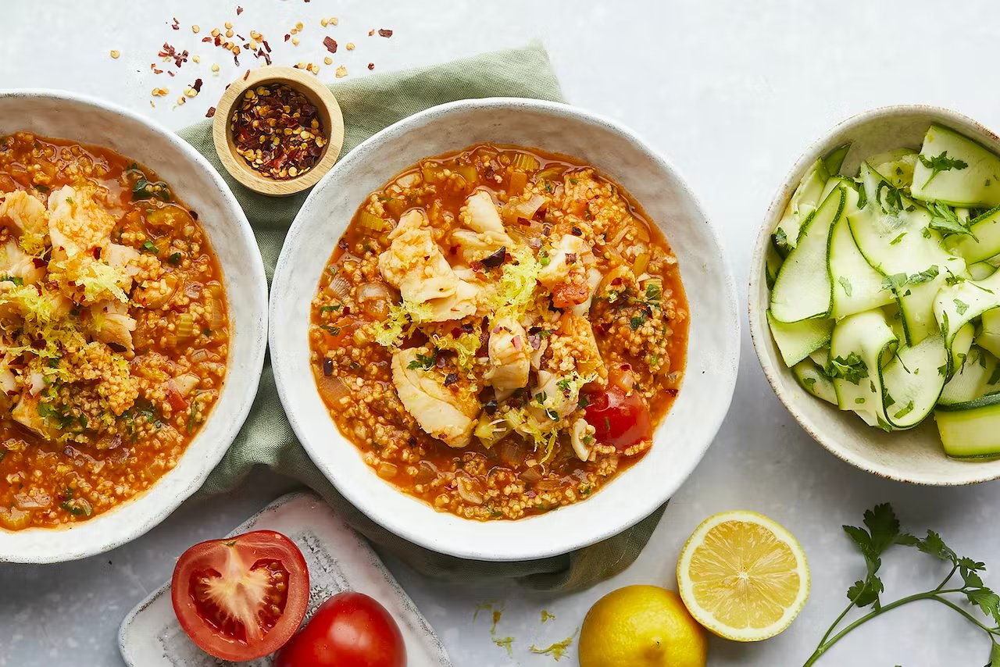

With the dev server running, try the following in `playground/content/live-reload/`:

1. **Edit** `fish-stew.jpg`, for example crop or resize it; the image and its size hints update in the browser
2. **Add** a new image, then reference it from this page; it's copied and served as soon as you save
3. **Delete** an image; it's removed from the cache and stops being served

::callout
Changing an image's size updates its `width`, `height` and `aspect-ratio` without a page reload.
::
