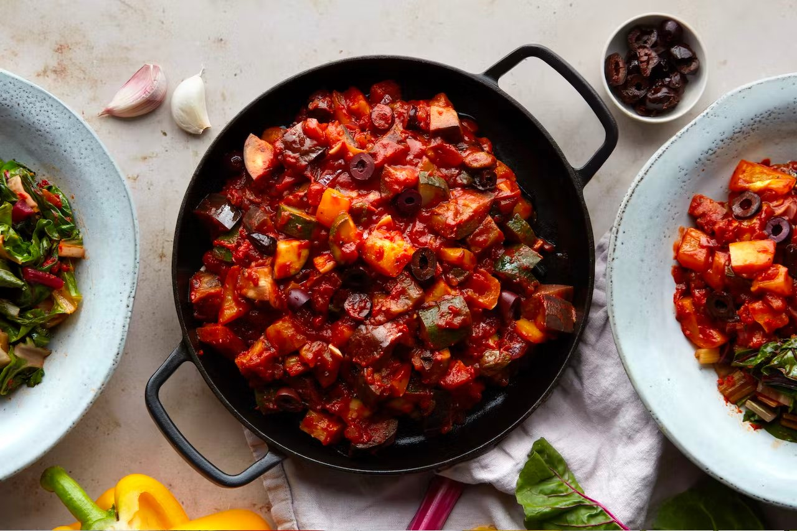

## Same folder



```md

```

## Sub folder


```md

```

## Parent folder


```md

```

## Absolute path

Absolute paths aren't rewritten, so they must point to where the asset is served:


```md

```

::note
In `dev` the module serves assets from its cache. In `build` and `generate` they're copied to the output folder and served from there.
::
