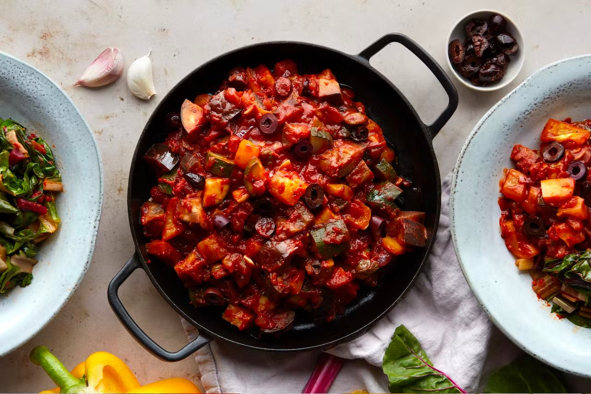

# Italian Bean Stew, Rainbow Chard & Quinoa

> Image in same folder

All those crowd-pleasing Italian flavours make it into this stew: sweet tomatoes, juicy black olives, punchy red pesto and zingy capers. Tricolour quinoa makes for a satisfying base, while rainbow chard counts towards your 5-a-day.

## Info

- Cook time: 35 mins
- Cuisine: Italian
- Food group: Vegan
- Key ingredient: Creamy filling butter beans
- Allergens: Celery, Sulphites

## Ingredients

- 1 aubergine
- 1 courgette
- 1 red onion
- 2 yellow pepper
- 600g passata
- 480g butter beans (drained)
- 60g pitted black olives
- 40g capers (Sulphites)
- 200g rainbow chard
- 160g tricolour quinoa
- 2 tbsp red pesto
- 1 tbsp dried Italian herbs
- 1 vegetable stock cube (Celery)
- 3 garlic clove

## Instructions

Boil a kettle. Dissolve the stock cube in a jug with 250ml boiling water.

Finely dice the onion. Finely chop or crush the garlic. Deseed the pepper and dice into 2cm squares. Cut the aubergine and courgette into 2cm cubes. Halve the olives. Drain the beans and rinse.

Heat a large saucepan with 2 tbsp oil on a medium heat. Add the onion, garlic, aubergine and peppers. Cook for 5 mins, until starting to soften, then add the courgette and cook for a further 2 mins. Add the beans, herbs, capers, passata, stock and half the olives. Season with sea salt and black pepper. Simmer for 10-15 mins, until the sauce has thickened.

Heat a large saucepan filled with salted boiling water on a high heat. Add the quinoa and boil for 13-14 mins, until cooked, then drain.

Meanwhile, thinly slice the chard, keeping the leaves separate from the stems. Heat a small frying pan with 1 tsp oil on a medium-high heat. Cook the chard stems for 2 mins, then add the leaves, cooking until wilted. Stir in the pesto, then lightly season with sea salt and black pepper.

Serve the stew with the quinoa and chard. Garnish with the remaining olives.

---

Recipe from [Mindful Chef](https://www.mindfulchef.com/healthy-recipes/italian-bean-stew-rainbow-chard-and-quinoa)
