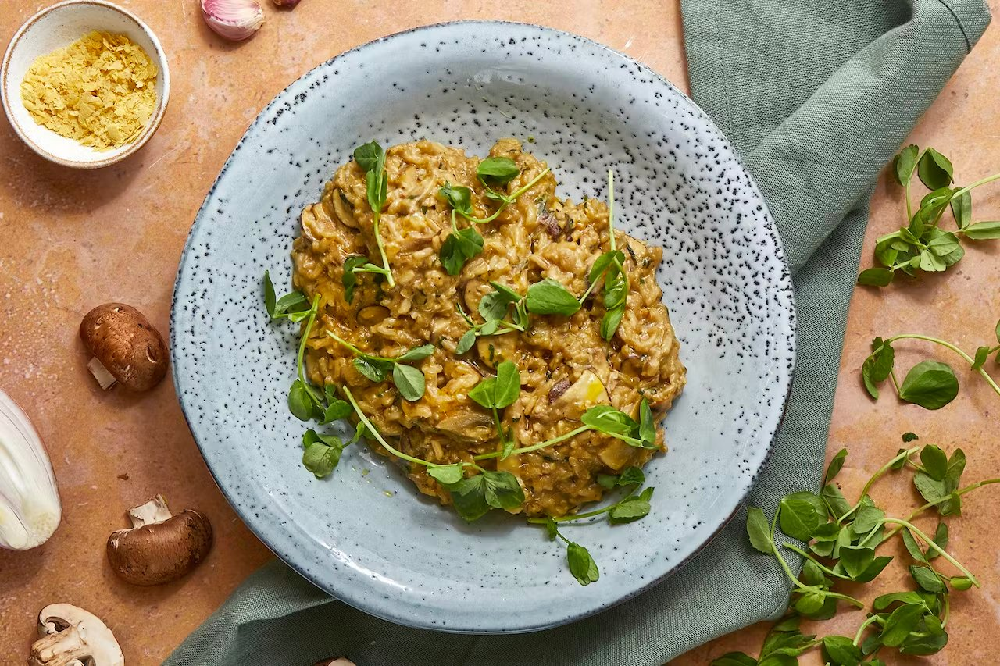

# Tarragon & Cashew Mushroom Risotto

> Content from GitHub

Tarragon and mushroom, the dream combo, star in this easy risotto. Chop, slice, simmer – with creamy cashew butter, garlic and cheez – then top with fresh green pea shoots and serve.

## Info

- Cook time: 15 mins
- Cuisine: European
- Food group: Vegan
- Key ingredient: Earthy chestnut mushrooms
- Allergens: Celery, Nuts, Sulphites

## Ingredients

- 120g chestnut mushrooms
- 250g steamed brown basmati rice (use half)
- 25g pea shoots
- 20g cashew parm cheez (Nuts)
- 1 shallot
- 1 garlic clove
- 1 tbsp cashew butter (Nuts)
- 1 vegetable stock cube (Celery)
- 1 tbsp nutritional yeast
- 1 tbsp aged balsamic vinegar (Sulphites)
- 1 handful of fresh tarragon

## Instructions

Boil a half-full kettle. Dissolve the stock cube in 50ml water. 

Finely chop or crush the garlic. Finely dice the shallot. Thinly slice the mushrooms. Pick the tarragon from its stalks and finely chop.

Heat a medium saucepan with 1 tsp oil on medium-high heat. Add the shallot, garlic and mushrooms, and cook for 5 mins, until softened.

Add the cashew butter, tarragon, nutritional yeast, cheez, vinegar and stock. Cook for 1 min, then add half the rice. Cook for 3 mins, add more water if it's too thick. Season with sea salt and black pepper.

Serve the risotto garnished with pea shoots. Enjoy the remaining pea shoots as a side salad with a drizzle of 1/2 tsp olive oil, seasoned with sea salt and black pepper.

---

Recipe from [Mindful Chef](https://www.mindfulchef.com/healthy-recipes/truffled-tarragon-mushroom-risotto-with-pea-shoots)
